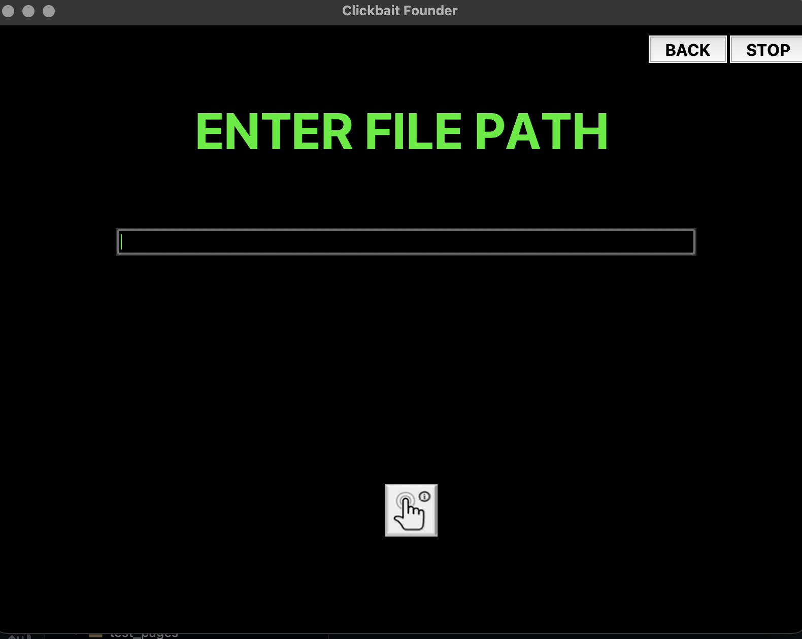
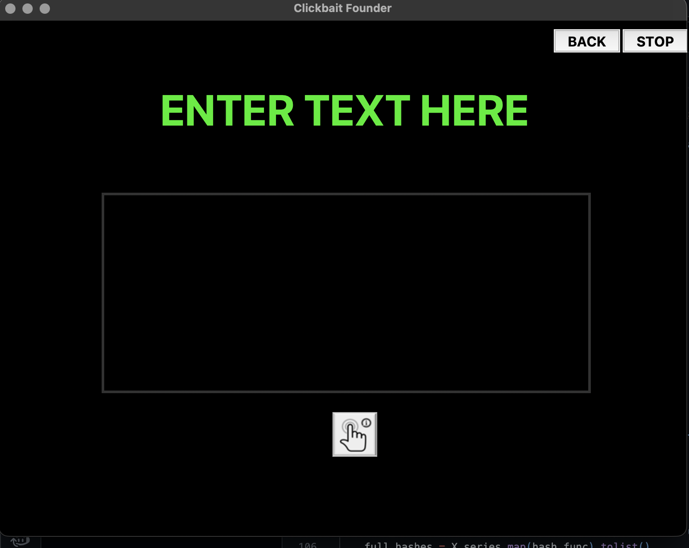
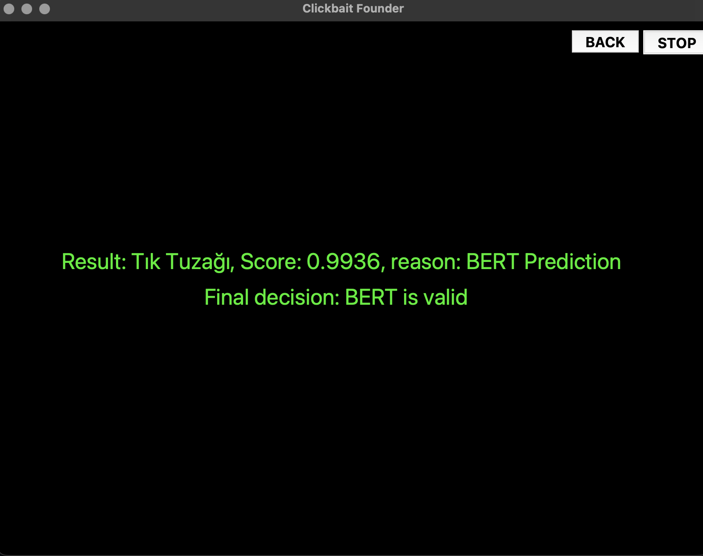
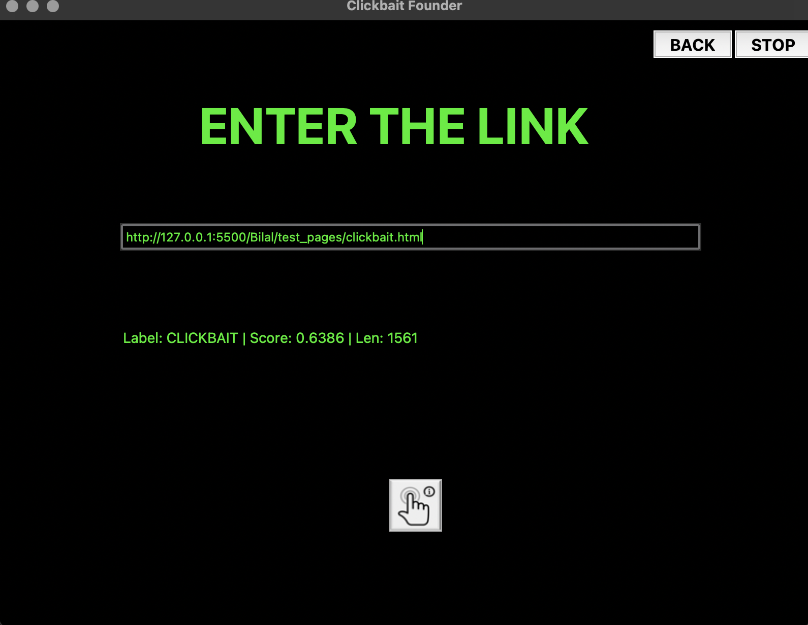
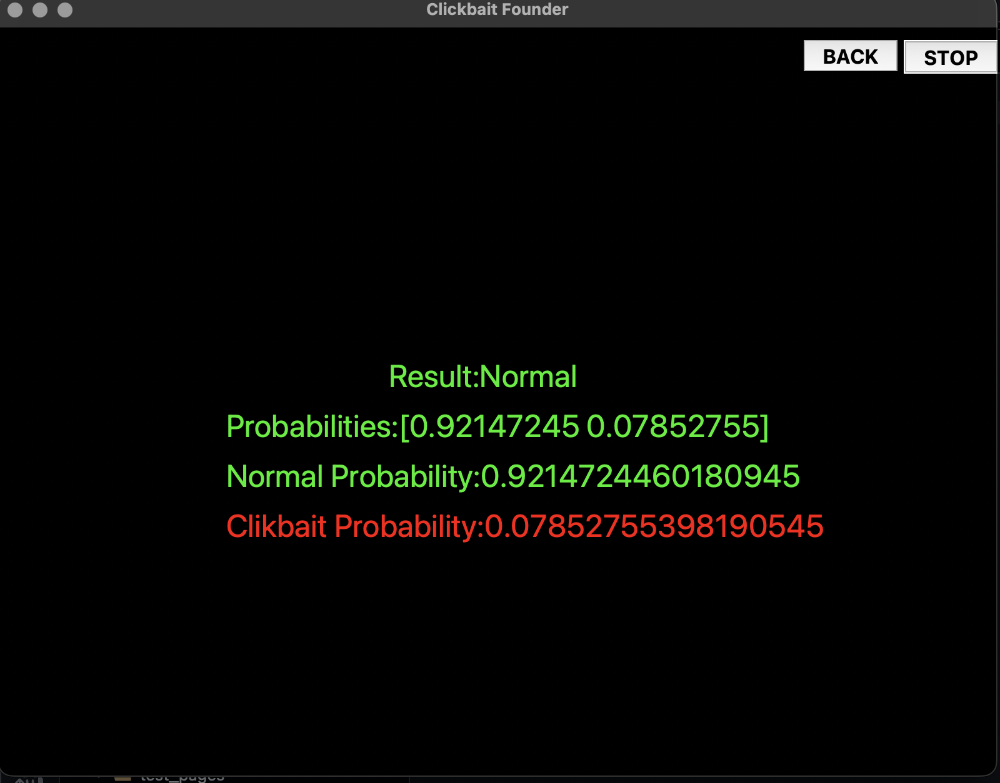

# 🧠 Clickbait Detector from Text, URL, and File

This project was developed by **Ali M. Kandemir** and **Bilal İzzettin** for the **Data Mining** course.  
It uses **BERT** and **TF-IDF** models to detect whether a given text is *clickbait* or not.  
Additionally, **URL** and **file** input options are available — allowing the program to fetch text from web pages or read it directly from uploaded files.  

> ⚠️ *Note:* The accuracy of the models is limited due to inconsistencies in the training dataset.

---

## 📁 Project Structure

| File | Description |
|------|--------------|
| **`main.py`** | Launches the graphical user interface (GUI) and manages model calls. |
| **`BERT_detector.py`** | Contains the BERT-based clickbait detection model. |
| **`alistfidf.py`** | Implements the TF-IDF-based model for detecting clickbait in text and files. |
| **`URL_Clickbait_detector.py`** | Uses TF-IDF and heuristic methods to detect clickbait from web page URLs. |
| **`URL_Clickbait_detector_train.py`** | Handles training of the TF-IDF and heuristic models using datasets under the `Data/` directory. |
| **`model/` & `final_clickbait_model/`** | Contain trained model weights and serialized outputs. |
| **`reports/`** | Includes simple runtime logs and functional reports. |

---

## ⚙️ How It Works

1. **Text Detection** → Uses the **BERT** model for classifying manually entered text.  
2. **URL Detection** → Uses **TF-IDF** and **heuristic** approaches to extract and analyze webpage titles or content.  
3. **File Detection** → Uses **TF-IDF** model for evaluating bulk text input from `.txt` files.

Each model was trained separately, allowing modular improvement and experimentation with new datasets.

---

## ▶️ Running the Program

1. Open a terminal in the `Ana_uyg/` directory.  
2. Ensure all files listed above are present.  
3. Run the following command:

```bash
python main.py
```
4. On first launch, the program will load pre-trained models — this may take some time.
5. Once loaded, the graphical interface (GUI) will appear, allowing you to:
  •	Test text directly
	•	Paste URLs for evaluation
	•	Upload files for batch testing


## Interface Screenshots

### 🏠 Main Page


### 📝 Text Input & Result Page



### 🌐 URL Input & Result Page


### 📂 File Input & Result Page


